# NMEA Injector: Technical Overview

### Purpose

`nmea_injector` is a configurable NMEA 0183 GPS data simulator. It is designed for testing GPS-dependent hardware or software by providing a realistic, controllable stream of NMEA sentences without requiring a live GPS signal. The application is built with Python, using Tkinter for the GUI.

### Core Architecture

The application's architecture is designed around a clear separation of concerns, primarily dividing the UI, simulation engine, and movement logic. This makes the system modular and extensible.

It employs a multi-threaded model to ensure a responsive UI:
1.  **Main Thread**: Runs the Tkinter event loop for the GUI.
2.  **Simulation Thread**: A background thread that handles the core simulation loop, including position calculations and NMEA sentence generation. This prevents the UI from freezing during simulation.
3.  **GUI Update Thread**: A background thread that fetches data from the simulator and schedules updates to the UI components on the main thread, acting as a bridge between the simulation and the UI.

### Component Breakdown

**1. UI Layer (`gui.py`)**
*   **Role**: Manages the application's state and all user interaction. It acts as a client to the simulation engine.
*   **Functionality**:
    *   Constructs the `Simulator` instance and configures it based on user input (e.g., selecting a targeting mode, setting speed).
    *   Instantiates the appropriate `TargetingStrategy` and injects it into the `Simulator`.
    *   Communicates with the `Simulator` thread to start/stop the simulation.
    *   Retrieves data from the simulator to update the `tkintermapview` visualization and the NMEA data panel.

**2. Simulation Core (`simulator.py`)**
*   **Role**: Orchestrates the entire simulation.
*   **Functionality**:
    *   The `Simulator` class holds a `GpsReceiver` model, which represents the current state of the simulated device (position, speed, satellites, etc.).
    *   The `serve()` method spawns the main simulation loop in a background `threading.Thread`.
    *   It utilizes the **Strategy design pattern** by delegating all movement calculations to a `TargetingStrategy` object. This decouples the simulation loop from the specifics of any movement algorithm.

**3. Strategy Layer (`targeting.py`)**
*   **Role**: Encapsulates the algorithms for GPS movement.
*   **Functionality**:
    *   Defines the `TargetingStrategy` abstract base class, which establishes a contract for all movement algorithms. The key method is `get_next_position()`.
    *   This design allows new movement patterns to be added with no modification to the `Simulator` class.
    *   Concrete implementations include:
        *   `StaticTargeting`: No movement.
        *   `LinearTargeting`: Moves towards a fixed coordinate.
        *   `CircularTargeting`: Follows a circular path.
        *   `WaypointTargeting`: Follows a sequence of coordinates, used for F1 circuits.

**4. Data Loading (`circuit_loader.py`)**
*   **Role**: A utility module that acts as a data provider for the `WaypointTargeting` strategy.
*   **Functionality**:
    *   Parses waypoint data from the `circuits.geojson` file.
    *   Decouples the waypoint data source from the movement logic itself.

### Execution Flow

1.  **Instantiation**: The `EnhancedNMEAGUI` class initializes a `Simulator` instance.
2.  **Configuration**: User selections in the GUI lead to the instantiation of a specific `TargetingStrategy` (e.g., `WaypointTargeting` is created with data provided by the `circuit_loader`).
3.  **Activation**: The chosen strategy is injected into the `Simulator` via `set_targeting()`. When the user clicks "Start," `simulator.serve(blocking=False)` is called, launching the simulation in a background thread.
4.  **Simulation Loop (Background Thread)**:
    *   The loop iterates at a configurable frequency (e.g., 5 Hz).
    *   Within a thread lock, it calls `__step()`, which delegates to the active `TargetingStrategy`'s `get_next_position()` method.
    *   The strategy returns the new GPS state (lat, lon, heading, speed).
    *   The `Simulator` updates its internal `GpsReceiver` model, which in turn generates the corresponding NMEA sentence strings.
5.  **UI Update Loop (Background Thread)**:
    *   This loop fetches the latest NMEA sentences and GPS state from the `Simulator`.
    *   To maintain thread safety with Tkinter, it uses `root.after()` to schedule the actual UI component updates on the main thread.

### Architecture Diagram

```mermaid
flowchart TD
    subgraph "User Interface (gui.py)"
        A[GUI Controls] --> B{Start/Stop};
        C[Map View] --> D[GPS Marker & Trail];
        E[NMEA Data Panel];
    end

    subgraph "Simulation Engine (simulator.py)"
        F[Simulator] -- Manages --> G[GpsReceiver Model];
        F -- Uses --> H{Targeting Strategy};
    end

    subgraph "Movement Logic (targeting.py)"
        H -- Is a --> I[StaticTargeting];
        H -- Is a --> J[LinearTargeting];
        H -- Is a --> K[CircularTargeting];
        H -- Is a --> L[WaypointTargeting];
    end

    subgraph "Data Sources"
        M[circuits.geojson] -- Loaded by --> N[circuit_loader.py];
    end

    B -- "Start" --> F;
    F -- "Updates" --> G;
    F -- "Generates" --> O[NMEA Sentences];
    
    subgraph "GUI Update Loop"
        P[GUI Thread] -- "Fetches" --> O;
        P -- "Updates" --> C;
        P -- "Updates" --> E;
    end

    A -- "Selects Circuit" --> N;
    N -- "Provides Waypoints" --> L;
    F -- "Sets Strategy" --> L;

    style F fill:#51355e,stroke:#333,stroke-width:2px
    style H fill:#3c4063,stroke:#333,stroke-width:2px
```

